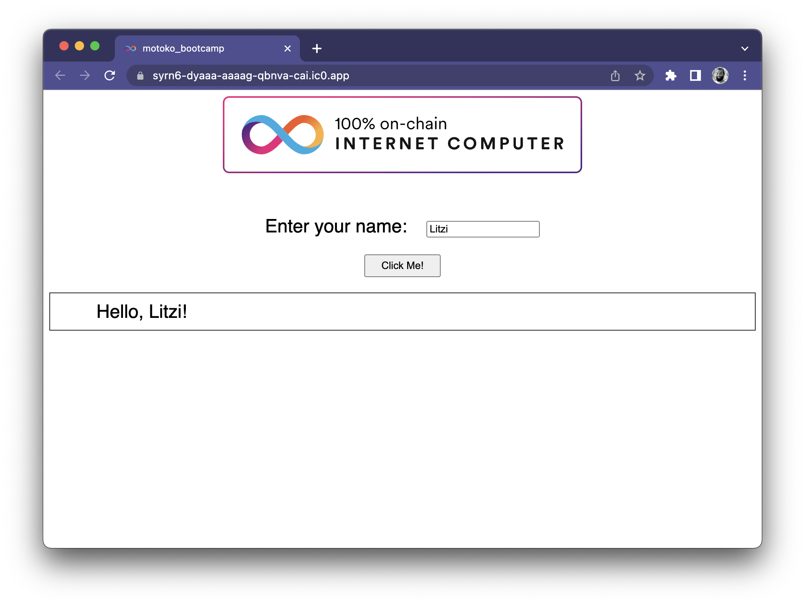
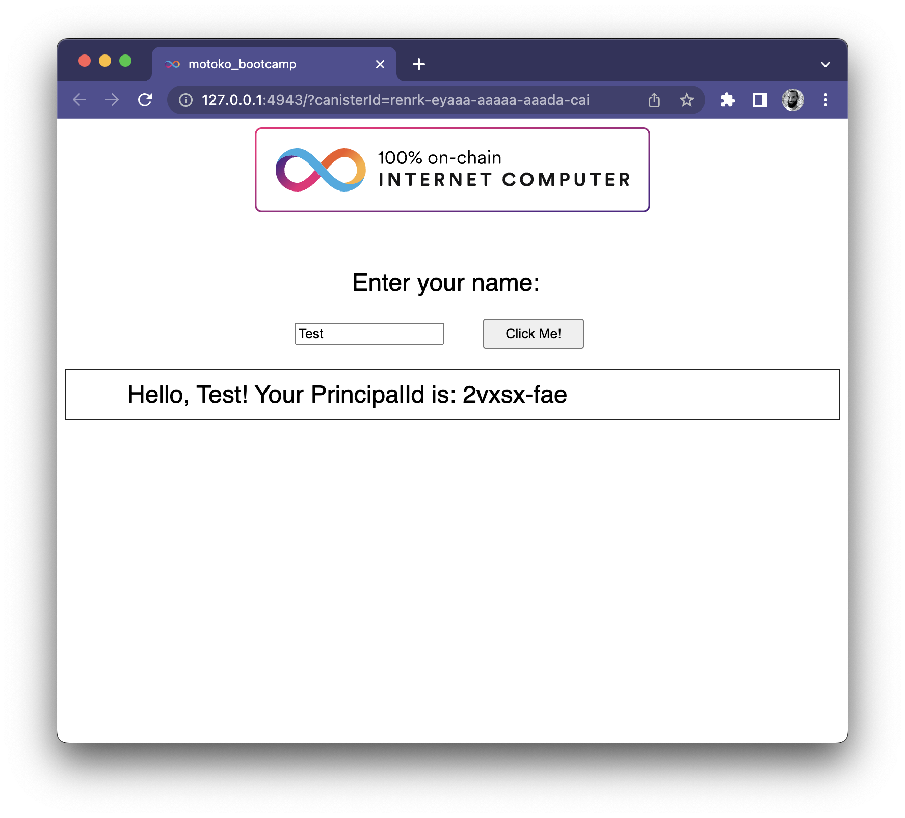
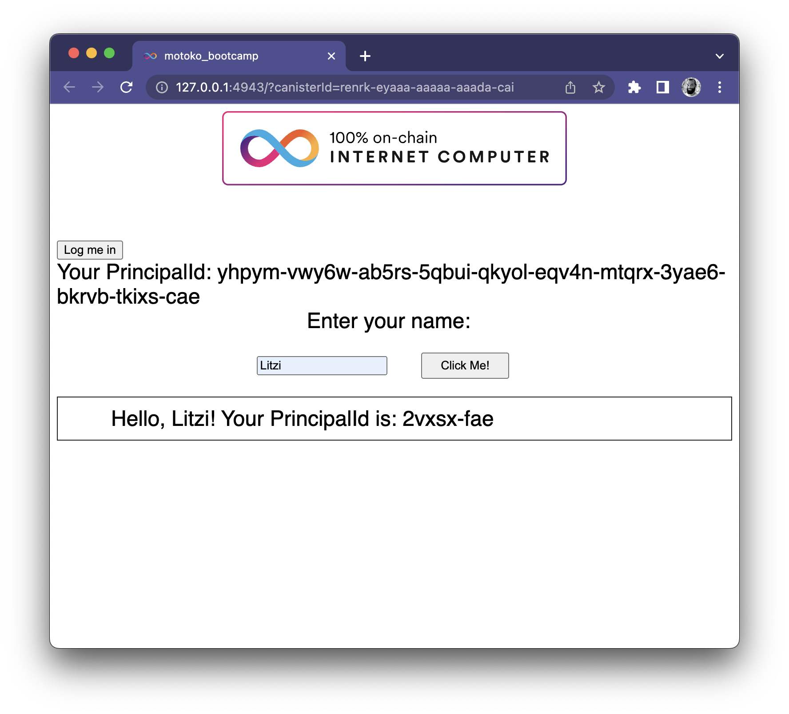
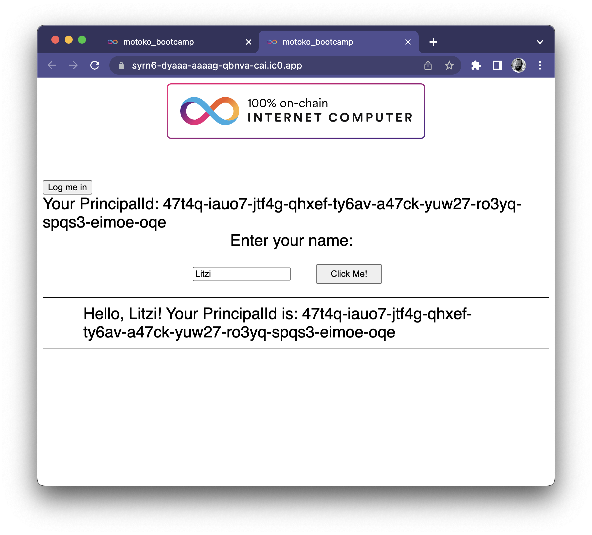
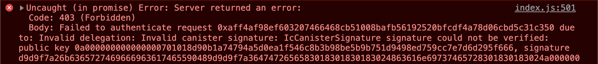
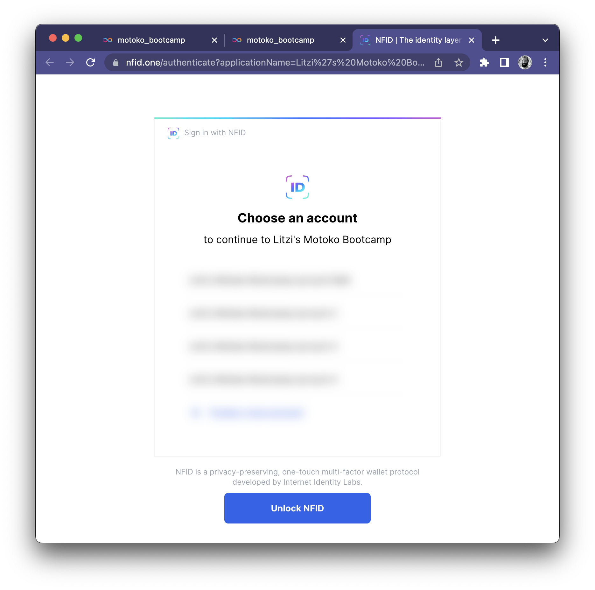
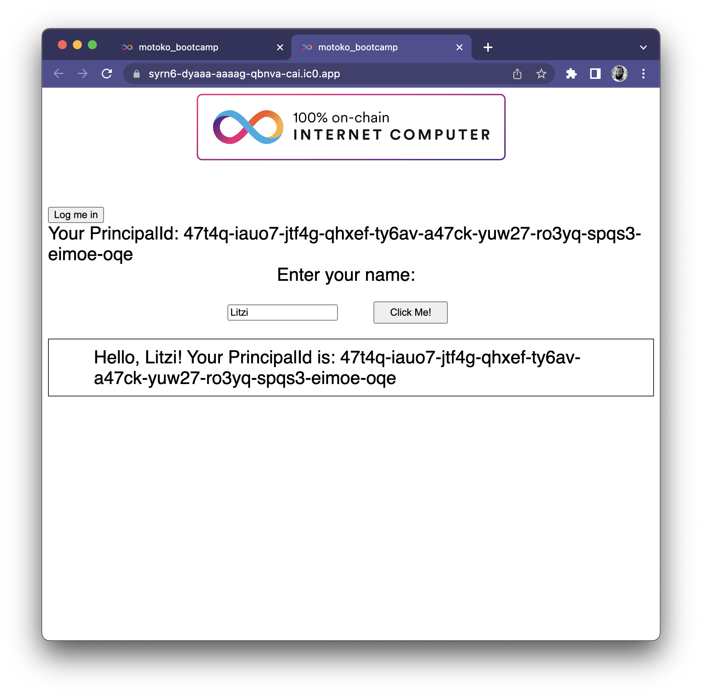
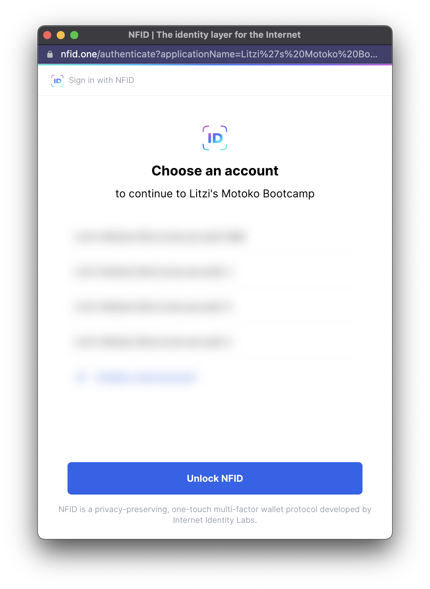

# Internet Identity Labs Motoko Bootcamp

## Step 0: Bootstrap and deploy project

Please follow the steps from [DFINITYs quickstart 10 min tutorial](https://internetcomputer.org/docs/current/developer-docs/quickstart/hello10mins)

You should end up with your deployed sample app looking like this:



## Step 1: Getting the identity within the backend canister

On the backend, we want to retrieve the users identity to differentiate him from other users.

To get the identity we need to update our query function from:

```
actor {
  public query func greet(name : Text) : async Text {
    return "Hello, " # name # "!";
  };
};
```

to:

```
import Principal "mo:base/Principal";

actor {
  public shared query({caller}) func greet(name : Text) : async Text {
    return "Hello, " # name # "! " # "Your PrincipalId is: " # Principal.toText(caller);
  };
};

```

when you deploy the changes with:

```
dfx deploy --network ic
```

And then again click the button, you should see the response:



## Step 2: Getting an identity from II

the identity you've received in the previous step is the anonymous identity. Every unauthenticated call will have the same id.

But you are interested in the unique identity of your individual users. To get this, you need to request one from an Identity Provider (`IDP`). We'll use DFINITYs Internet Identity in the following steps.

We need to install DFINITYs `AuthClient` package to talk to the `IDP`:

```
npm install --save @dfinity/auth-client
```

Now we can add a login button to our `index.html` within `motoko_bootcamp_frontend`:

```Html
<!DOCTYPE html>
<html lang="en">
  <head>
    <meta charset="UTF-8" />
    <meta name="viewport" content="width=device-width" />
    <title>motoko_bootcamp</title>
    <base href="/" />
    <link rel="icon" href="favicon.ico" />
    <link type="text/css" rel="stylesheet" href="main.css" />
  </head>
  <body>
    <main>
      
      <br />
      <br />
      <div>
        <button id="login">Log me in</button>
      </div>
      <div id="principalId"></div>
      <form action="#">
        <label for="name">Enter your name: &nbsp;</label>
        <input id="name" alt="Name" type="text" />
        <button type="submit">Click Me!</button>
      </form>
      <section id="greeting"></section>
    </main>
  </body>
</html>

```

And a `onClick` handler to the `index.js`:

```JavaScript
import { AuthClient } from "@dfinity/auth-client";
import { motoko_bootcamp_backend } from "../../declarations/motoko_bootcamp_backend";

let authClient = null;

async function init() {
  authClient = await AuthClient.create();
}

document.querySelector("form").addEventListener("submit", async (e) => {
  e.preventDefault();
  const button = e.target.querySelector("button");

  const name = document.getElementById("name").value.toString();

  button.setAttribute("disabled", true);

  // Interact with foo actor, calling the greet method
  const greeting = await motoko_bootcamp_backend.greet(name);

  button.removeAttribute("disabled");

  document.getElementById("greeting").innerText = greeting;

  return false;
});

function handleSuccess() {
  const principalId = authClient.getIdentity().getPrincipal().toText();

  document.getElementById(
    "principalId"
  ).innerText = `Your PrincipalId: ${principalId}`;
}

document.getElementById("login").addEventListener("click", async (e) => {
  if (!authClient) throw new Error("AuthClient not initialized");

  authClient.login({
    onSuccess: handleSuccess,
  });
});

init();

```

Time to deploy again:

```
dfx deploy --network ic
```

When you click the button "Log me in", and running through the authentication process on Internet Identity, you'll see something like this:



So we get the principalId on the frontend but the backend still doesn't retrieve it. Let's fix that in the next step.

## Step 3: Getting the same identity backend side

To make authenticated calls to our backend, we need to pass the received identity to the javascript agent who is making the requests on our behalf. So add an import to your `index.js` file like so:

```Javascript
import { Actor } from "@dfinity/agent";
```

And update the `handleSuccess` function like so:

```Javascript
function handleSuccess() {
  const principalId = authClient.getIdentity().getPrincipal().toText();

  document.getElementById(
    "principalId"
  ).innerText = `Your PrincipalId: ${principalId}`;

  Actor.agentOf(motoko_bootcamp_backend).replaceIdentity(
    authClient.getIdentity()
  );
}
```

Time to deploy again:

```
dfx deploy --network ic
```



When you deploy this locally (`dfx deploy`) and try to click the `Click Me!` button after you've authenticated, you'll receive an error like this:



To fix that, we'll need to deploy Internet Identity to the local replica which you have started with `dfx start`. If you need help with that, please [shoot me](https://twitter.com/__litzi__) or [IdentityMaxies](https://twitter.com/identitymaxis) a DM on Twitter.

## Step 4: Using another identity provider (e.g. AstroX or NFID)

All `AuthClient` compatible Identity Provider can now be used. Therefore we just need to replace the default `identityProvider` when calling `authClient.login`.

We change:

```Javascript
document.getElementById("login").addEventListener("click", async (e) => {
  if (!authClient) throw new Error("AuthClient not initialized");

  authClient.login({
    onSuccess: handleSuccess,
  });
});
```

to:

```Javascript
document.getElementById("login").addEventListener("click", async (e) => {
  if (!authClient) throw new Error("AuthClient not initialized");

  const APP_NAME = "Litzi's Motoko Bootcamp";
  const APP_LOGO = "https://nfid.one/icons/favicon-96x96.png";
  const CONFIG_QUERY = `?applicationName=${APP_NAME}&applicationLogo=${APP_LOGO}`;

  const identityProvider = `https://nfid.one/authenticate${CONFIG_QUERY}`;

  authClient.login({
    identityProvider,
    onSuccess: handleSuccess,
  });
});
```

and deploy again:

```
dfx deploy --network ic
```

After that you'll see NFID as an Identity Provider when clicking on `Log me in`:



After gently smashing the `Click Me!` button:



## Step 5: Improving UX by opening the IDP in a popup window

by default, IDP opens in a new tab. There is a more user friendly configuration to handle the IDP in a popup window.

Change the `config` passed to `authClient.login` to the following:

```Javascript
  authClient.login({
    identityProvider,
    onSuccess: handleSuccess,
    windowOpenerFeatures: `
      left=${window.screen.width / 2 - 525 / 2},
      top=${window.screen.height / 2 - 705 / 2},
      toolbar=0,location=0,menubar=0,width=525,height=705
    `,
  });
```

when redeploying:

```
dfx deploy --network ic
```

the IDP loads in a popup like this:


